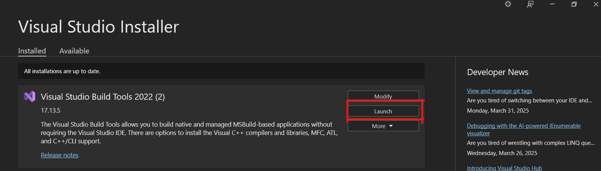

# liboqs-node

Node.js bindings for [liboqs](https://github.com/open-quantum-safe/liboqs) (Open Quantum Safe) through [liboqs-cpp](https://github.com/open-quantum-safe/liboqs-cpp).

```js
  Random, // Utilities for generating secure random numbers
  KEMS, // Information on supported key encapsulation mechanisms
  KeyEncapsulation, // Key encapsulation class and methods
  Sigs, // Information on supported signature algorithms
  Signature // Signature class and methods
```
## Requirements

1. **Node.js** (LTS version recommended, e.g., 16 or 18)
2. **Python 3** (required by `node-gyp`)
3. **Git**
4. **Visual Studio 2022** (or Build Tools for Visual Studio 2022) with C++ development tools (Windows only) and Windows 10 SDK.
5. **CMake** (3.15+ recommended)
6. **Ninja** (the build tool for CMake)
7. **OpenSSL** (for Windows, install a 64-bit version to `C:/Program Files/OpenSSL-Win64` or adjust paths accordingly)

> **Note:** On macOS or Linux, you can install OpenSSL using Homebrew/apt/etc., and use Clang or GCC.

## Quick Start (Windows)

1. **Install Node.js**  
   - [NodeJS official site](https://nodejs.org). Ensure `npm` is also installed.  
   - Verify with:
     ```bash
     node -v
     npm -v
     ```

2. **Install Python 3**  
   - [Python.org Downloads](https://www.python.org/downloads/)  
   - Verify with:
     ```bash
     python --version
     ```

3. **Install Visual Studio or Build Tools**  
   - Install the standalone [**Build Tools for VS 2022**](https://aka.ms/vs/17/release/vs_BuildTools.exe).  
   - Make sure to include “Desktop development with C++ + Windows 10 SDK”.
4. **Install Choco**
   - Install choco using this [article guide](https://www.liquidweb.com/blog/how-to-install-chocolatey-on-windows/)
5. **Install CMake**  
    ```bash
     choco install cmake
    ```  
   - Verify with:
     ```bash
     cmake --version
     ```

6. **Install Ninja**  
   ```bash
    choco install ninja
   ``` 
   - Verify with:
     ```bash
     ninja --version
     ```

7. **Install Git**  
   - [Git official site](https://git-scm.com/downloads).  
   - Verify with:
     ```bash
     git --version
     ```

8. **Install OpenSSL**  
   - On Windows, obtain a 64-bit build of OpenSSL, e.g. from [slproweb](https://slproweb.com/products/Win32OpenSSL.html).  
   - Install it to `C:\Program Files\OpenSSL-Win64\` (the default location).  
   - Ensure you have:
     ```
     C:\Program Files\OpenSSL-Win64\lib\VC\x64\MD\libcrypto.lib
     C:\Program Files\OpenSSL-Win64\lib\VC\x64\MD\libssl.lib
     ```
   - If installed elsewhere, adjust paths in `Bindings.gyp`.

9. **Clone this repo**  
   ```bash
   git clone https://github.com/your-user/liboqs-node-windows.git
   cd liboqs-node-windows
   ```

10. **Install Node dependencies**  
  ```bash
   npm install
   ```
   - If this command shows error try install manually
  ```bash
   npm install --save-dev node-pre-gyp
   ```
   - This installs `node-addon-api`, `node-gyp`, etc.

11. **Prepare dependencies**  
    - This clones `liboqs` and `liboqs-cpp` into `deps/`, checks out specific commits, and does minor patching.
    ```bash
    npm run prep
    ```

12. **Build**  
    - For **Windows** open the “x64 Native Tools Command Prompt for VS 2022” as shown in image
     
    - Then go to the project location
    - Then run:
      ```bash
      npm run build:windows
      ```
    - Under the hood:
      - `npm run liboqs:build:windows` uses `cmake -G "Visual Studio 17 2022" -A x64` and `msbuild`.
      - `node-gyp rebuild` compiles the Node addon.

13. **Build for electron**
   - Execute this command 
    ```bash
    npx electron-rebuild
    ```

13. **Result**  
    - On success, you get a native addon file at `build/Release/liboqs_node.node`.  
    - Require it in your Node/Electron project:
      ```js
      const oqs = require('./build/Release/liboqs_node.node');
      console.log(oqs);
      ```
      or try running

      ```bash 
      node example_kems.js
      ```

---

## License

This project is licensed under [ISC](LICENSE) (or whichever license applies).  
liboqs and liboqs-cpp have their own respective licenses. See their repositories for details.

---

### Troubleshooting

1. **`msbuild` is not recognized**  
   - Use the “x64 Native Tools Command Prompt for VS 2022” or switch to `cmake --build`.

2. **OpenSSL not found**  
   - Make sure you installed it in the path matching `Bindings.gyp` or updated the `.gyp` file for your location.

3. **Python or node-gyp not found**  
   - Verify you installed Python 3, run `npm config set python "C:/Path/To/python.exe"` if needed.

---
